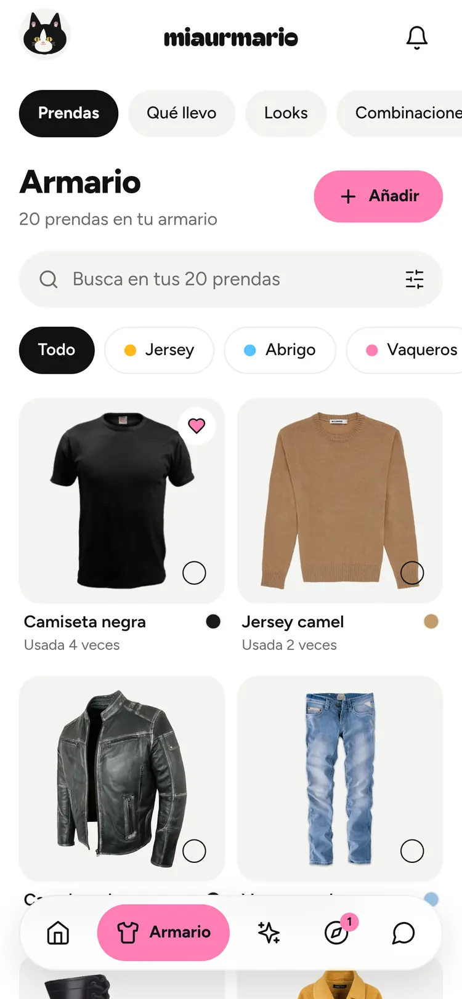
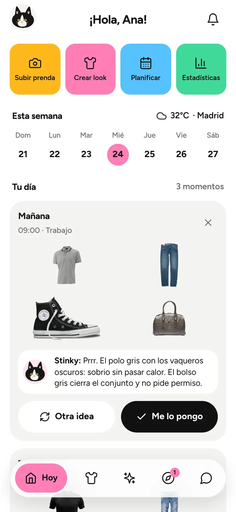
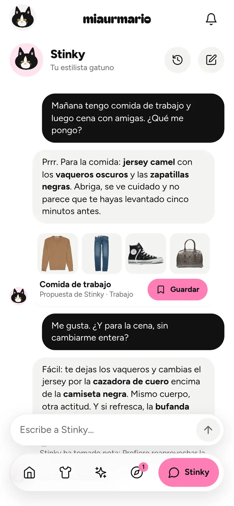
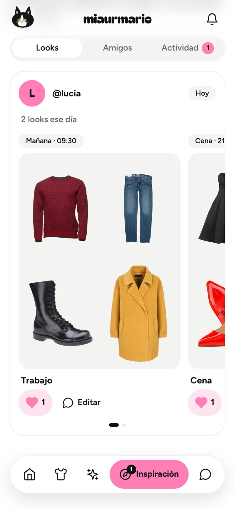

<p align="center">
  
</p>

<h1 align="center">Miaurmario</h1>

<p align="center"><em>Tu armario, con criterio felino.</em></p>

<p align="center">
  <a href="https://nextjs.org/"></a>
  <a href="https://fastapi.tiangolo.com/"></a>
  <a href="https://www.typescriptlang.org/"></a>
  <a href="https://www.python.org/"></a>
  <a href="./LICENSE"></a>
</p>

<p align="center">
  <a href="#what-it-is">What it is</a> •
  <a href="#what-it-does">What it does</a> •
  <a href="#quick-start">Quick start</a> •
  <a href="#configuration">Configuration</a> •
  <a href="#development">Development</a> •
  <a href="#deployment">Deployment</a> •
  <a href="#credit-and-licence">Credit</a>
</p>

---

## What it is

Miaurmario is a self-hosted wardrobe app. You photograph the clothes you own;
the app cuts them out of their background, tags them, and then **Stinky** — a
tuxedo cat who is the app's stylist — proposes looks made only from garments you
actually have, taking into account the weather where you are, what you are doing
that day, the taste profile you gave him, and what you have been listening to.

Two things are worth knowing before you read further.

**The interface is in Spanish.** Not translated Spanish: Spanish is the source
language and English follows it. The English catalogue is complete and kept in
sync, but the switcher is currently off (one flag in
`frontend/components/language-switcher.tsx`), so the running app is Spanish-only.

**The AI is optional, and the no-AI path is not a degraded mode.** Background
removal runs locally with [rembg](https://github.com/danielgatis/rembg) and never
touches the network. Tagging can be done by hand. Outfits fall back to a
deterministic scorer when no model is available. An operator can run this with no
AI provider configured at all, and it is still a wardrobe app.

This started as a fork of [Anyesh/wardrowbe](https://github.com/Anyesh/wardrowbe)
and has since become a different product. See
[Credit and licence](#credit-and-licence).

## Screenshots

These are the four screens the landing page shows, at phone width, which is the
size almost every user is on.

| | |
|:---:|:---:|
|  |  |
| **Armario** — every garment photographed and cut out, filterable by type and colour, each one carrying how often you have worn it. | **Hoy** — "Tu día", with a look per moment: *Mañana · 09:00 · Trabajo*, and Stinky saying why. **Otra idea** or **Me lo pongo**. |
|  |  |
| **Stinky** — ask him in plain Spanish. He reads your wardrobe through tools and answers with a look you can save. | **Inspiración** — a friend's day as a carousel of its moments. Only what you chose to share. |

## What it does

### Getting clothes in

- **Photograph a garment** and the background comes off locally, with no API key
  and no network call. An optional vision model then tags it: type, subtype,
  primary colour and colour list, pattern, material, formality, style, season and
  fit. Without AI you pick those from tappable Spanish chips — including quick
  buttons built from the garments already in *your* wardrobe.
- **Bulk upload** with a queue that survives closing the sheet and resumes after
  a reload ("Retomo N fotos de la última vez"), followed by a **quick review**
  pass: one-tap type and colour for everything that came back untagged, a colour
  eyedropper you point at the photo, rotate-and-save, and "Es la espalda de…".
- **Front and back.** Every photo knows which side it shows — *Delante*,
  *Detrás*, *Detalle* — and a stray photo can be merged into the garment it
  belongs to.
- **The eraser** ("Borra lo que sobra"). Cut-out models fill holes the fabric
  encloses: a halter neckline, the inside of a bag handle. Brush, lasso,
  rectangle and move tools, in erase or restore mode, with zoom and undo, edit
  the *stored* alpha, so the fix shows on every screen afterwards. It works on a
  garment whose background was never removed, which is the whole cut-out story
  for someone running without AI.
- **Other ways in**: share a photo into the app (Web Share Target), paste a shop
  link and let the server read the page's OpenGraph/JSON-LD metadata, or scan a
  care label.

### Getting dressed

- **Momentos del día.** A day holds up to six looks, not one. The presets are
  *Mañana 09:00 · trabajo*, *Tarde 15:00 · casual*, *Noche 20:30 · cita*, plus a
  free-text *Otro*. A **transición** reuses the earlier moment's pieces and swaps
  only one or two — the outer layer, the shoes — so you are not changing
  completely to go to dinner.
- **El Estilista** takes the occasion, the time of day, the real weather
  (temperature, feels-like, condition, chance of rain, from
  [Open-Meteo](https://open-meteo.com/) with no API key), your taste profile, what
  you have worn recently, and optionally a song, and returns three outfits with a
  headline and two sentences of reasoning each.
- **Habla con Stinky** — a streaming chat. He has tools: read the wardrobe, read
  the weather, read recent outfits, read your listening mood, show an outfit,
  create one, remember something, forget something. Answers arrive with an outfit
  card you can save.
- **Stinky recuerda** — a per-user memory he writes himself, one short note at a
  time, capped and evictable. You can read, edit, pin and delete every note in
  Ajustes. The prompt carries an explicit do-not-record list (health, body,
  religion, sexuality, politics, money, other people).
- **Tu estilo con Stinky** — a swipe deck rather than a form. Looks, silhouettes
  and palettes, answered *me gusta* / *no me va* / *ni fu ni fa*, in a one-minute
  or a three-minute version. It ends by showing you, in words, exactly what it
  understood. It asks about clothes, never about your body.
- **Qué llevo puesto** — point the camera at yourself and the app reads the
  outfit off the photo and matches each piece against your wardrobe ("Esto es tu
  jersey camel" / "Esto no lo tienes"). The selfie is stripped of EXIF, resized
  in memory and **never written to disk**.

### Sharing, and knowing what you wear

- **Amigos.** Friends are found by handle only — a username prefix search, rate
  limited against enumeration. There is no email lookup. Looks are private by
  default; you choose *friends* or *public* per look. The feed groups a friend's
  day into a carousel of its moments, with "me encanta" and comments. Blocked
  users are indistinguishable from users who do not exist.
- **Wear stats.** Times worn, days since last worn, what each garment has gone
  out with, and **coste por uso** — price divided by wears, which is simply
  absent rather than infinite for something you have not worn yet. At wardrobe
  level: what is idle at three and six months, and a flag that suppresses the
  numbers entirely while they would still be noise.
- **Notifications.** Email is on by default for friend requests, accepted
  requests and the daily outfit; Web Push (VAPID) is on by default for those plus
  the friend-activity digest. The morning look is opt-in and fires at your own
  local hour. The scheduled "Look del día" goes out the same way. Push reaches
  both the browser and the Android/iOS app. The per-user channels inherited
  from upstream (ntfy, a Mattermost webhook, a separate SMTP address, Expo
  push) are gone; SMTP survives only as the operator's fallback transport when
  Resend isn't configured.
- **Música.** Connect [Last.fm](https://www.last.fm/api) (username only, no
  password) and a worker syncs your public scrobbles every 15 minutes. A
  deterministic heuristic turns artist genres, title keywords and release years
  into one of nine daily moods, which becomes a *contexto musical* block in the
  stylist's prompt — palette, texture, silhouette. The prompt is explicit that
  the mood describes the music, never the person.

### Running it

- **PWA.** Installable from the browser, standalone, with a share target and an
  in-app update prompt.
- **Android and iOS app.** A [Capacitor](https://capacitorjs.com/) shell around
  the live site (`mobile/`), adding OS push (FCM / APNs), real haptics, the
  Android back button and links that open in the app. Built on this machine for
  Android and on GitHub's macOS runners for iOS; see
  [docs/native-app.md](docs/native-app.md).
- **Offline wardrobe.** Installed (PWA or app), the wardrobe, looks, history and
  their photos stay readable without a connection: the service worker keeps the
  app and the photos, React Query keeps a copy of the data in IndexedDB. Read
  only; anything that needs the server waits for the connection.
- **Sign-up gate.** Sign-up mode is an admin-panel setting (`open` or
  `invite_only`) that takes effect without a redeploy. Closed, the login page
  offers a waitlist that always answers 202 whether or not the address is known,
  so it cannot be used to enumerate accounts. Addresses in `ADMIN_EMAILS` always
  get through, so you cannot lock yourself out.
- **Admin panel** — Resumen, Usuarios, Registro, Buzón, Sistema. Signups over
  time, AI usage and an estimated cost against a monthly budget, granting and
  capping AI per user, invite codes, the waitlist, an in-app feedback inbox, an
  announcement banner, an audit log and account deletion as an audited background
  job. By design it shows counts only — never anybody's wardrobe, looks or
  photos.
- **AI access modes**, per user: `none`, `platform` (the admin grants you the
  deployment's key, with an optional monthly request cap), or `byok` (your own
  key for any OpenAI-compatible provider, stored Fernet-encrypted, HTTPS only,
  re-checked against private address ranges on every call). Vision and text are
  separate capabilities: a text-only key means no auto-tagging and no selfie.

### Things this does not do

Stated plainly, because the old README claimed some of them:

- **There is no native app** and none is planned. No App Store, no Google Play.
  It installs from the browser.
- **There is no hosted service to sign up for.** Run your own.
- **Pinterest is not connected to anything yet.** The OAuth flow, the board
  import and the pin gallery are written and work, but the app is still waiting
  on Pinterest's API approval, and imported pins are *not* read by the stylist or
  by Stinky. Today it is a gallery.
- **Spotify only works for allow-listed accounts.** The app is in Spotify's
  development mode, which caps it at five users. Last.fm is the path that works
  for everyone. (Spotify also stopped serving audio features — valence, energy —
  to apps created after November 2024, so the mood is inferred from genres,
  titles and years, not from Spotify's own metrics.)
- **Familia** — the household feature inherited from upstream — still exists in
  the code but is deliberately hidden from the navigation, because it overlapped
  with Amigos and confused people.
- **The Kubernetes manifests in `k8s/` are inherited and unverified.** This
  project is deployed with Docker Compose.

## Quick start

You need Docker and Docker Compose. Nothing is published to a container
registry, so the images are built from this repository — the first build takes a
while, mostly because the backend image bakes in the rembg model weights.

```bash
git clone https://github.com/andreipopx/miaurmario.git
cd miaurmario
cp .env.example .env
```

Edit `.env`. For a local run you only need to leave `SECRET_KEY` at its default
and add `DEBUG=true`, which enables the development login — **which lets anyone
sign in as any email with no verification**, so never do this on anything
reachable from the internet.

```bash
docker compose up -d --build

# Migrations are never run automatically. Always run them yourself:
docker compose exec backend alembic upgrade head

curl http://localhost:8000/api/v1/health     # {"status":"healthy"}
```

- App: <http://localhost:3000>
- API docs: <http://localhost:8000/docs> (and `/redoc`)
- What the AI is actually doing: <http://localhost:8000/api/v1/capabilities>

For hot reload while developing, add the dev overlay, which also brings up Caddy
with a self-signed certificate on `wardrobe.local`:

```bash
docker compose -f docker-compose.yml -f docker-compose.dev.yml up -d --build
docker compose exec backend alembic upgrade head
```

## Configuration

Everything lives in `.env`, which is documented in full in
[`.env.example`](.env.example) — every setting the backend reads is in there,
grouped, with its default. This section is the short version.

### Required

Nothing is required by the config class itself: every setting has a default and
the app will boot with an empty environment. These are the ones that are
enforced at runtime or by Compose.

| Variable | Why |
|---|---|
| `POSTGRES_PASSWORD` | Compose refuses to start without it. |
| `SECRET_KEY` | The backend **raises on startup** if this is still `change-me-in-production` and `DEBUG` is false. Signs API tokens and the unsubscribe links, so the worker must have the same value. `openssl rand -hex 32`. |
| `NEXTAUTH_SECRET` | Compose refuses to start without it. `openssl rand -hex 32`. |
| One way to sign in | `RESEND_API_KEY` (magic link), **or** `OIDC_ISSUER_URL` + `OIDC_CLIENT_ID`, **or** `DEBUG=true` with the default `SECRET_KEY` for local development. With none of them the app starts and logs an error, and nobody can log in. |

### Worth setting

| Variable | Default | What it does |
|---|---|---|
| `APP_URL` | `http://localhost:3000` | Canonical public origin used in notification and invite links. |
| `MAGIC_LINK_BASE_URL` | falls back to `APP_URL` | Origin of the emailed sign-in link. Fixed config, deliberately never derived from the `Host` header. |
| `ADMIN_EMAILS` | empty | Comma-separated. These accounts are promoted to site admin on login, always have AI, and always pass the sign-up gate. Idempotent — remove an address and it is demoted next login. |
| `STORAGE_PATH` | `/data/wardrobe` | Where photos land. `docker-compose.prod.yml` uses `/data/uploads` instead; match your volume. |
| `AUTH_TRUST_HOST` | unset | Set it if you serve the app on more than one origin (LAN name *and* public hostname). Your proxy must then set `X-Forwarded-Host`/`-Proto` and overwrite any client-supplied value. |
| `VAPID_PUBLIC_KEY` / `VAPID_PRIVATE_KEY` | unset | Web Push. Generate once with `docker compose exec backend python scripts/generate_vapid_keys.py`, and set the pair on **both** backend and worker. Unset hides the push channel entirely. |
| `INTEGRATIONS_TOKEN_ENCRYPTION_KEY` | unset | Fernet key that encrypts stored OAuth tokens. Rotating it invalidates them; users reconnect. |
| `BG_REMOVAL_MODEL` | `isnet-general-use` | See below. |
| `AI_INTERNAL_ENABLED` | `true` | Set to `false` to run with no internal AI provider at all. `AI_VISION_ENABLED` and `AI_TEXT_ENABLED` inherit it unless set explicitly. |

Two settings are **not** environment variables, because they are edited live
from the admin panel and stored in the `app_settings` table: `signup_mode`
(`open` by default) and the AI pricing used for the cost estimate.

### AI provider

Any OpenAI-compatible endpoint. `.env.example` ships Ollama defaults, with
commented blocks for OpenAI, LocalAI and Azure.

```env
AI_BASE_URL=http://host.docker.internal:11434/v1
AI_API_KEY=not-needed
AI_VISION_MODEL=llava:7b
AI_TEXT_MODEL=gemma3:latest
```

Use `host.docker.internal`, not `localhost`, so the container can reach a model
running on the host. `AI_VISION_MODEL` and `AI_TEXT_MODEL` accept a
comma-separated list, which is used for rotation. Users on **bring-your-own-key**
choose their own provider in Ajustes → IA; the UI has presets for DeepSeek,
OpenAI, OpenRouter and Groq, plus a custom option and a "Probar conexión" button
that reports latency per capability.

### Background removal

`rembg`, locally, by default — no key, no network. `BG_REMOVAL_PROVIDER=http`
delegates to an external service instead (`BG_REMOVAL_URL`, `BG_REMOVAL_API_KEY`).

The thing that goes wrong is a hole the fabric *encloses* — a halter neckline,
the space inside a bag handle, the gap between an arm and the body — which stays
filled with background. Measured on textured synthetic photos whose holes we know
the truth for; "leak" is how much of the hole is left opaque, so **0 is
see-through and 1 is the bug**:

| `BG_REMOVAL_MODEL` | halter neck | bag handle | arm gap | worst IoU | s/photo | size |
| --- | --- | --- | --- | --- | --- | --- |
| `u2net` | 0.996 | 0.067 | 0.540 | 0.941 | 1.0 | 168 MB |
| **`isnet-general-use`** (default) | 0.996 | **0.011** | **0.025** | 0.958 | 1.4 | 171 MB |
| `birefnet-general-lite` | **0.028** | **0.005** | **0.019** | **0.999** | 11.0 | 214 MB |

Read that honestly. `isnet-general-use` is the default because it solves the arm
gap and the bag handle outright at the same order of cost. **It does not solve a
small enclosed neckline** — only `birefnet-general-lite` does, and it is about
eight times slower, too slow to sit inside an upload. All three are baked into
the backend image, so choosing another is one environment variable and no
network. A model that is not on disk falls back to `BG_REMOVAL_FALLBACK_MODEL`
(`u2net`, always present) with a warning, so a typo cannot leave the app with no
cut-outs at all.

Whatever the model misses, the user fixes with the eraser — and that part is
actually guaranteed.

### Location and privacy

Two things are detected, and only these two are kept: **your city and your
timezone**. They exist for the weather behind your outfits and the hour your
notifications arrive.

- **Timezone** is read from the browser on first load. Pick one by hand in
  Ajustes and detection never touches it again.
- **City** only when you tap "Usar mi ubicación", which makes *your browser* ask
  permission. Typing the city works just as well.
- **Exact coordinates are never stored or logged.** The reading is rounded to two
  decimals (~1 km, the city centre) in the browser *and* again on the server,
  before anything reaches the geocoder, the database or a log.
- **Travelling never moves your city on its own.** More than 100 km away, the app
  asks once a day ("¿Estás en Lisboa?") and waits for an answer.
- "Borrar mi ubicación" in Ajustes removes it.
- No third-party trackers and no IP geolocation. Reverse geocoding a rounded
  point goes to [OpenStreetMap Nominatim](https://nominatim.openstreetmap.org/),
  as does geocoding a city name you typed.

## Architecture

```
                     Caddy + Cloudflare Tunnel   (on the host, outside this repo)
                                 │
                         nginx  (127.0.0.1:8080)
              ┌──────────────────┴──────────────────┐
              │                                     │
   Next.js 14 frontend  ──────────────────▶  FastAPI backend
   (App Router, next-auth v4,                (SQLAlchemy async, Alembic)
    next-intl, TanStack Query)                       │
                                        ┌────────────┼────────────┐
                                        │            │            │
                                  PostgreSQL 15   Redis 7    AI provider
                                        │            │       (optional)
                                        └──── arq worker ─────┘
```

nginx routes `/api/auth/*` to the frontend (next-auth lives there), gives the
outfit-suggestion and pairing endpoints a long read timeout, turns buffering and
gzip off for the Stinky chat stream, and sends everything else to the backend or
the frontend. It publishes on loopback only; TLS and the public hostname are
handled by Caddy and a Cloudflare Tunnel configured outside this repository.

| Layer | What |
|---|---|
| Frontend | Next.js 14 (App Router), React 18, TypeScript 5.7, TanStack Query v5, Tailwind 3 with all colours as CSS variables, Radix/shadcn primitives, `@dnd-kit` for the outfit canvas, next-intl v3, next-auth v4 |
| Backend | FastAPI, SQLAlchemy 2 async + asyncpg, Pydantic v2, Alembic, Python 3.11 |
| Worker | arq — 17 jobs and 7 cron schedules: tagging, notifications, the morning look, the friend digest, Last.fm and Spotify syncs, Pinterest refresh, learning-profile updates, stale-job recovery, account deletion |
| Data | PostgreSQL 15, Redis 7 (queue, rate limits, caches). Photos are plain files on a volume — there is no S3 |
| Images | Pillow + pillow-heif, rembg (ONNX, CPU) |
| Auth | next-auth v4 — magic link via Resend, optional argon2id password, OIDC, dev credentials. JWT sessions that slide on refresh |

## Development

The full contributor guide is [CONTRIBUTING.md](CONTRIBUTING.md). In short:

```bash
# Backend, from backend/
ruff check . && ruff format --check .
pytest                       # needs Postgres + Redis + TEST_DATABASE_URL

# Migrations, from the repo root
python backend/scripts/check_migration_heads.py

# Frontend, from frontend/
npm run lint && npx tsc --noEmit && npm test && npm run build
```

CI (`.github/workflows/ci.yml`) runs exactly those on Python 3.11 and Node 24,
and builds both Docker images.

The backend test suite requires `TEST_DATABASE_URL` and has **no fallback to
`DATABASE_URL`**, on purpose — a test run can never touch your real data. It
creates the database if needed and builds the schema with the real migrations
rather than `create_all`, so a broken migration fails the tests.

### Migrations

Alembic, in `backend/migrations/`, run with `backend/` as the working directory.
The DSN comes from `DATABASE_URL` at runtime; the placeholder in `alembic.ini` is
never used.

```bash
docker compose exec backend alembic upgrade head
docker compose exec backend alembic current
docker compose exec backend alembic downgrade -1
```

**Migrations never run automatically** — not in the entrypoint, not on startup,
not in the k8s manifests. Running them is always a step you take.

There must be exactly one head; `backend/scripts/check_migration_heads.py`
enforces it in CI.

## Deployment

`docker-compose.prod.yml` is the real one: Postgres, Redis, backend, worker,
frontend and nginx on a bridge network, with nginx published on `127.0.0.1:8080`
for a reverse proxy on the host to pick up.

Both images are built from this repository. Nothing is published to a registry;
`BACKEND_IMAGE` and `FRONTEND_IMAGE` let you override the tags if you push them
somewhere yourself.

```bash
# 1. Build the two images
docker compose -f docker-compose.prod.yml build backend frontend

# 2. Migrate BEFORE the new code serves traffic
docker compose -f docker-compose.prod.yml run --rm backend alembic upgrade head

# 3. Recreate the containers
docker compose -f docker-compose.prod.yml up -d --force-recreate backend worker frontend
```

A few things that are easy to get wrong:

- `SECRET_KEY`, `RESEND_*` and `MAGIC_LINK_BASE_URL` must be **identical on the
  backend and the worker** — the worker signs the one-click unsubscribe links in
  the emails it sends.
- Push to the Android/iOS app (`FCM_SERVICE_ACCOUNT_JSON`, `APNS_*`) goes on the
  backend **and** the worker, like VAPID; the App Links / Universal Links ids
  (`ANDROID_APP_CERT_SHA256`, `APPLE_TEAM_ID`) on the frontend.
- The frontend service sets `NODE_TLS_REJECT_UNAUTHORIZED=0`, which disables TLS
  verification for the whole Node process. It is there for internal OIDC
  providers with private certificates; prefer `OIDC_CA_BUNDLE` and remove it.
- `STORAGE_PATH` is `/data/uploads` in this file and `/data/wardrobe` elsewhere.
  Whichever you pick, the volume has to match, or yesterday's photos vanish.

## Credit and licence

Miaurmario began on 2026-07-21 as a fork of
**[Anyesh/wardrowbe](https://github.com/Anyesh/wardrowbe)** by **Anish Shrestha**,
at that project's version 1.5.1. The wardrobe data model, the learning and
pairing engines, the analytics, the wash tracking, the OIDC sign-in and the
FastAPI/arq skeleton all started there, and a good deal of that code is still
underneath. Thank you — this would not exist otherwise.

Everything since is a different product: the Spanish interface, Stinky and his
chat and memory, the moments of the day, friends, music, the selfie, the eraser,
the taste profile, the admin panel, the invite gate, the PWA and the design
system. [CHANGELOG.md](CHANGELOG.md) keeps the two histories separate;
[FORK-NOTES.md](FORK-NOTES.md) maps what is whose.

The fork does not track upstream and nothing has been merged from it since the
fork point.

Licensed under the [MIT Licence](LICENSE), the same as the original, whose
copyright notice is retained.
